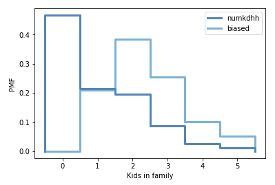

[Think Stats Chapter 3 Exercise 1](http://greenteapress.com/thinkstats2/html/thinkstats2004.html#toc31) (actual vs. biased)

---

**Exercise summary:** Use NSFG respondent variable 'numkdhh' to show acutal probability distribution for the number of children under 18 in each household, then compute a biased distribution as if the children were surveyed and aske how many total children lived in their household. Plot each distribution and compute their means.

---

For the actual distribution, the mean number of children in each household is 1.02. Were children to be asked how many lived in each household, including themselves, the mean would be 2.40. A plot of each probability mass function:



Not surprisingly, the probability of receiving an answer of 0 in the biased distribution is 0, considering the children would be surveyed. Despite there being slightly more households a with one child than those with two, the biased distribution shows the probability of an answer of two as double that of an answer of one, given that there are nearly twice as many children living in two-child households. From there, probabilities decrease, since the total numbers of children in three-, four-, and five-child households decrease as well.

#### Code used to solve exercise:
```python
# make probability mass funciton from numkdhh data
kdhh_pmf = thinkstats2.Pmf(resp.numkdhh, label='numkdhh_raw')


# make pmf for biased data
kdhh_pmf_biased = kdhh_pmf.Copy(label='numkdhh_bias')
for x, p in kdhh_pmf.Items():
    kdhh_pmf_biased[x] *= x
kdhh_pmf_biased.Normalize()

# compute and print means
print("Means")
print("Actual:", round(kdhh_pmf.Mean(),2), "children")
print("Biased:", round(kdhh_pmf_biased.Mean(),2), "children")

# plot two distributions
thinkplot.PrePlot(2)
thinkplot.Pmfs([kdhh_pmf, kdhh_pmf_biased])
thinkplot.Config(xlabel='Kids in family', ylabel='PMF')
```
