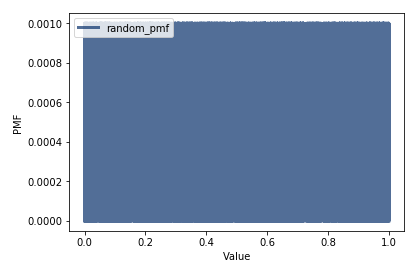

[Think Stats Chapter 4 Exercise 2](http://greenteapress.com/thinkstats2/html/thinkstats2005.html#toc41) (a random distribution)

---

**Exercise sumary:** Numbers generated by `np.random.random` should be uniform from 0 to 1. Generate 1000 random numbers and plot their PMF. Anything wrong? Plot CDF, is the distribution uniform?

---

#### Plot of PMF:



Nothing is "wrong" here at all. Probability is static across the entire range (0.001 for each value), which is what one would ideally expect from a truly random distribution.

#### Plot of CDF:


A plot of the CDF shows an almost exactly straight line, indicating that the distribution is uniform.

#### Code used to solve exercise:

```python
# generate list of 1000 random numbers, PMF, CDF
randlist = [np.random.random() for _ in range(1000)]
rand_pmf = thinkstats2.Pmf(randlist, label="random_pmf")
rand_cdf = thinkstats2.Cdf(randlist, label="random_cdf")

# plot PMF
thinkplot.Pmf(rand_pmf)
thinkplot.Config(xlabel='Value', ylabel='PMF')

# plot CDF
thinkplot.Cdf(rand_cdf)
thinkplot.Config(xlabel='Value', ylabel='CDF')
```
